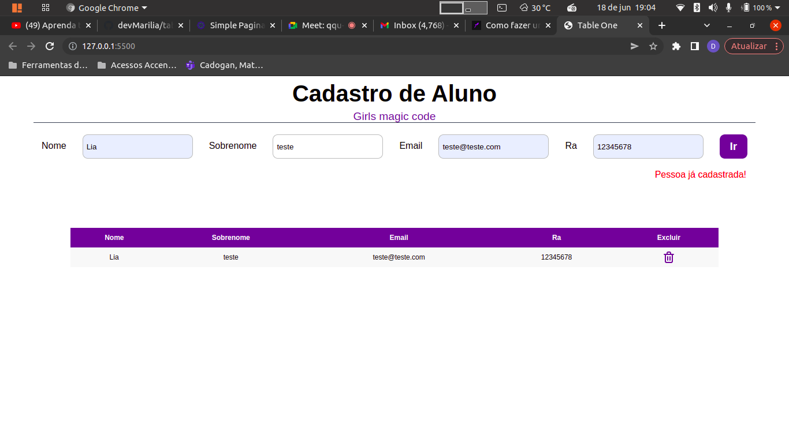

## Project Tble One
<h1 align="center">
    <a href="https://developer.mozilla.org/pt-BR/docs/Web/JavaScript">🔗 JavaScript</a>
</h1>

🚀 lib para construir interfaces dinamicamenente
  

<h4 align="center"> 
	🚧  Cadastro de Aluno (Tabçle one) 🚀 Em construção...  🚧
</h4>

Hoje vou misturar os códigos e fazer magia manupulando o DOM JavaScript

 

## :books: Funcionalidades
* <b>Funcionalidade 1</b>: Manipular o DOM alimentado a tabela de acordo com os dados inseridos no formulário;

